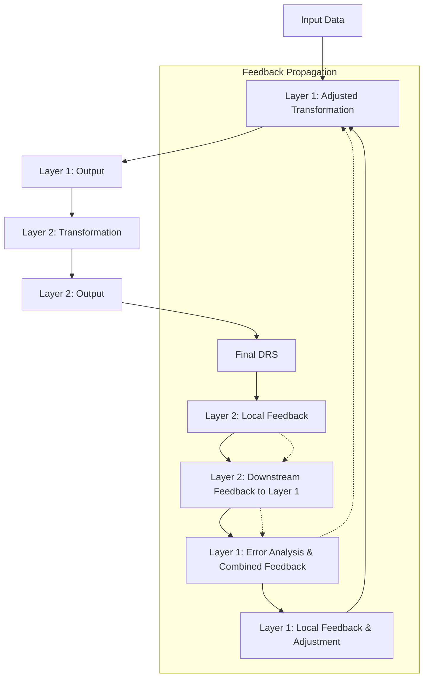

# TODO: Implementing Neural Network-like Backpropagation in Our Framework

## Overview

Our current framework transforms narratives into Discourse Representation Structures (DRS) through a sequence of transformation steps or "layers," including narrative segmentation, clause interpretation, lambda calculus conversion, and DRS assembly. Each of these steps is analogous to a layer in a neural network, processing input data and producing intermediate outputs that feed into the next stage.

While the framework works well in a localized manner, where each layer adjusts based on its immediate feedback, we are limited by the growing context lengths and increasing computational costs as the complexity of transformations increases. To address these challenges and improve the overall coherence and accuracy of our system, we propose mimicking the backpropagation mechanism used in neural networks.

This document outlines the detailed plan for integrating a backpropagation-like mechanism into our framework. The goal is to use downstream feedback (output from later stages) to refine the transformations performed by earlier stages, improving the alignment and quality of the final DRS output.

## Current Local Implementation

### 1. **Current Workflow**
- **Narrative Segmenter**: Splits the input narrative into clauses.
- **Clause Interpreter**: Converts each clause into a logical expression.
- **Lambda to DRS Updater**: Transforms logical expressions into a sequence of operations.
- **DRS Assembler**: Combines the operations into a final DRS with entities and conditions.

### 2. **Feedback Mechanism**
- Each layer currently receives feedback based on its immediate output.
- This feedback is used locally to adjust parameters or improve the transformation process for future inputs.
- **Limitation**: Feedback does not consider the global context or the impact of earlier transformations on later stages, leading to potential misalignments and suboptimal final outputs.

### 3. **Context Length Challenge**
- As the number of transformations increases, the context length grows, leading to higher computational costs and diminishing returns.
- The current system lacks an efficient method to filter and prioritize feedback, resulting in potentially redundant or irrelevant feedback being used.

## Proposed Backpropagation-like Mechanism

### 1. **Incorporating Downstream Feedback**
- **Downstream Feedback as Scratchpad**: Each layer's feedback will also serve as a scratchpad that documents insights and errors observed during the transformation. This scratchpad will be passed as downstream feedback to the previous layer, ensuring that the upstream transformations align with the needs of the entire sequence.
  
- **One-Step Propagation**: By combining the feedback and scratchpad into a single step, we can streamline the process and reduce the need for separate operations. This will allow each layer to adjust its transformation logic based on a richer context that includes both its own feedback and the downstream needs.

### 2. **Error Analysis and History Utilization**
- **Error Analysis**: Each layer will analyze its own errors based on the feedback it receives. This error analysis will consider the layer's historical behavior (e.g., recurring mistakes, successful transformations) to refine the current transformation process.

- **Feedback History Filtering**: To address the issue of growing context lengths, we will implement a filtering mechanism that selects the most relevant feedback from the history. The selection process will prioritize feedback that:
  - Directly relates to the current transformation context.
  - Has consistently led to successful transformations in the past.
  - Comes from layers that have a significant impact on the final output.

### 3. **Backpropagation-like Feedback Propagation**
- **Combined Feedback Generation**: Each layer will generate combined feedback that includes:
  - **Local Feedback**: Insights and adjustments based on the layer’s immediate output.
  - **Downstream Feedback**: Adjustments needed to align with the next layer’s requirements.
  - **Error-Driven Insights**: Derived from analyzing past errors and successes.
  
- **Feedback Propagation**: This combined feedback will be passed to the previous layer, which will use it to adjust its transformation process. The goal is to create a cascading effect where each layer refines its output to better support downstream layers, leading to a more coherent and accurate final DRS.

### 4. **Filtering Process for Relevant Feedback**
- **Relevance Scoring**: Each piece of feedback will be scored based on its relevance to the current context and its impact on past transformations. The scoring criteria may include:
  - **Contextual Similarity**: How closely the current input matches the scenarios where the feedback was previously applied.
  - **Outcome Effectiveness**: The extent to which the feedback improved the accuracy or coherence of previous transformations.
  - **Feedback Source Weighting**: Feedback from layers closer to the final output may be given more weight, as they directly influence the final DRS structure.

- **Feedback Selection**: Only the top-scoring feedback will be selected for each transformation step, ensuring that the system focuses on the most impactful and relevant insights.

## Implementation Steps

1. **Extend Morph Classes**:
   - Modify the `Morph` class to include fields for downstream feedback and error analysis.
   - Implement methods for generating combined feedback and propagating it to previous layers.

2. **Integrate Feedback Propagation in MorphSequence**:
   - Update the `MorphSequence` class to handle feedback propagation, ensuring that each layer can adjust based on both local and downstream feedback.

3. **Develop Feedback Filtering Mechanism**:
   - Implement relevance scoring and selection algorithms to filter feedback based on contextual similarity, outcome effectiveness, and feedback source weighting.

4. **Test and Optimize**:
   - Conduct iterative testing to fine-tune the feedback propagation and filtering mechanisms.
   - Optimize for computational efficiency to minimize the impact of the new system on processing time and resource usage.

## Anticipated Benefits

- **Improved Alignment**: Each layer's output will be better aligned with the needs of the entire transformation sequence, leading to more accurate and coherent final DRS outputs.
- **Reduced Computational Costs**: By filtering feedback and focusing on the most relevant insights, we can reduce the context length and associated computational costs.
- **Scalability**: The backpropagation-like mechanism will make the system more scalable, allowing it to handle more complex transformations without a linear increase in computational resources.

## Conclusion

This document outlines a detailed plan to enhance our current framework by incorporating a backpropagation-like mechanism. By mimicking neural network patterns, we aim to create a more efficient, accurate, and scalable system for transforming narratives into DRS. This implementation will not only improve the quality of our outputs but also ensure that the system can grow and adapt to more complex tasks with minimal increase in computational overhead.

The detailed steps provided here should serve as a comprehensive guide for the engineering AI agent to implement these changes. Given the agent's high level of expertise, this document has been crafted to be both thorough and actionable, ensuring a smooth transition from concept to implementation.